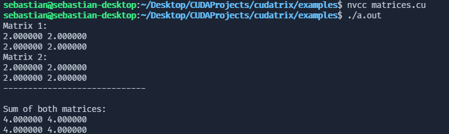

  

  <h1>CUDAtrix</h1>
  <h3>A library for matrix and scalar operations with CUDA.</h3>

I made this repository to learn more about linear algebra and CUDA.
As of now, CUDAtrix supports these operations:

- Matrix Sum
- Scalar Sum
- Matrix Multiplication
- Scalar Multiplication

And I'm planning on adding these operations:
- Vector Operations

All of the example usage of CUDAtrix functions is in the `/examples` directory.

Some resources that helped me create CUDAtrix:

- [Vectors and matrices by MITOpenCourseware](https://ocw.mit.edu/courses/mathematics/18-02sc-multivariable-calculus-fall-2010/1.-vectors-and-matrices/part-b-matrices-and-systems-of-equations/session-9-matrix-multiplication/)
- [An even easier introduction to CUDA by NVIDIA](https://developer.nvidia.com/blog/even-easier-introduction-cuda/)

    

